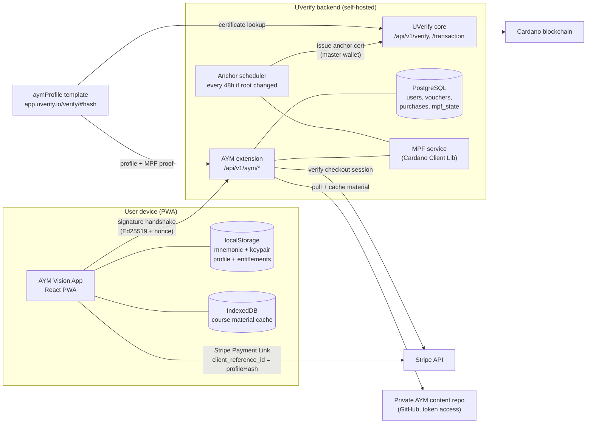
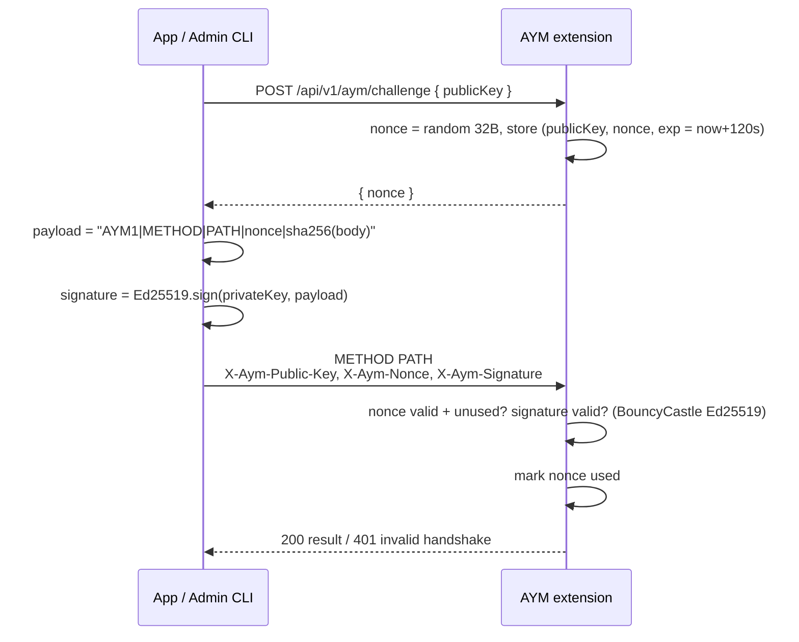
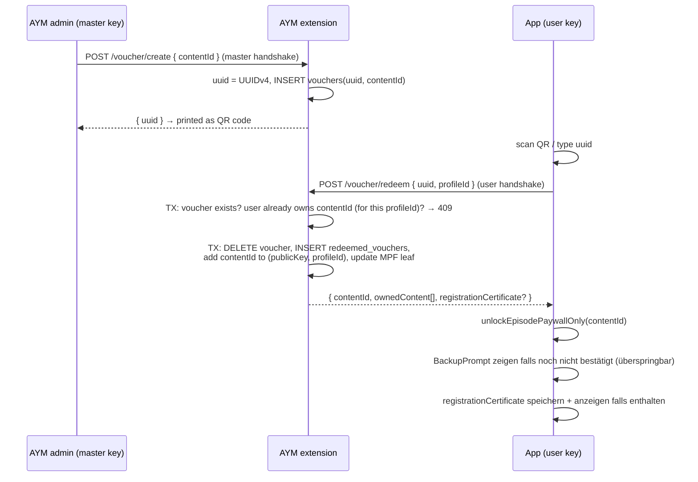
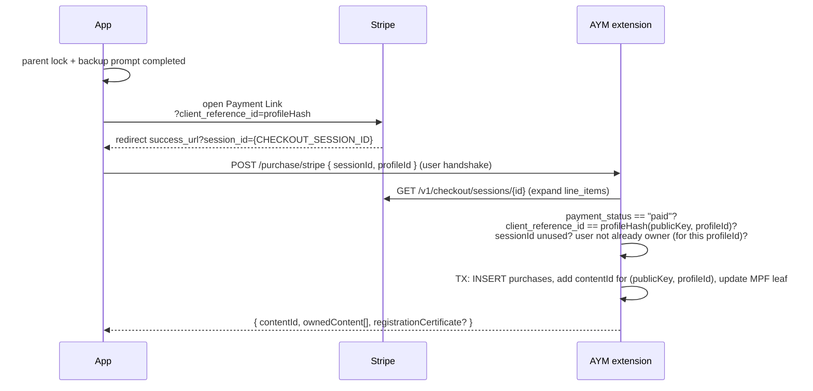
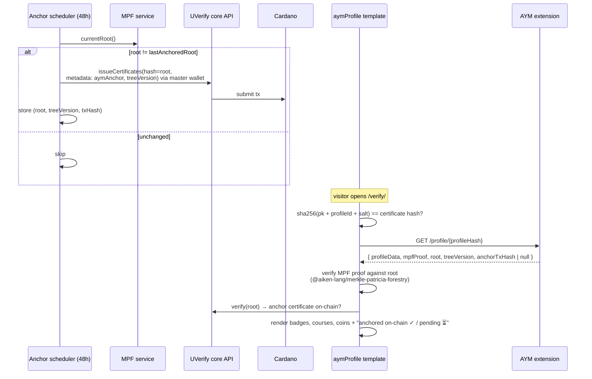
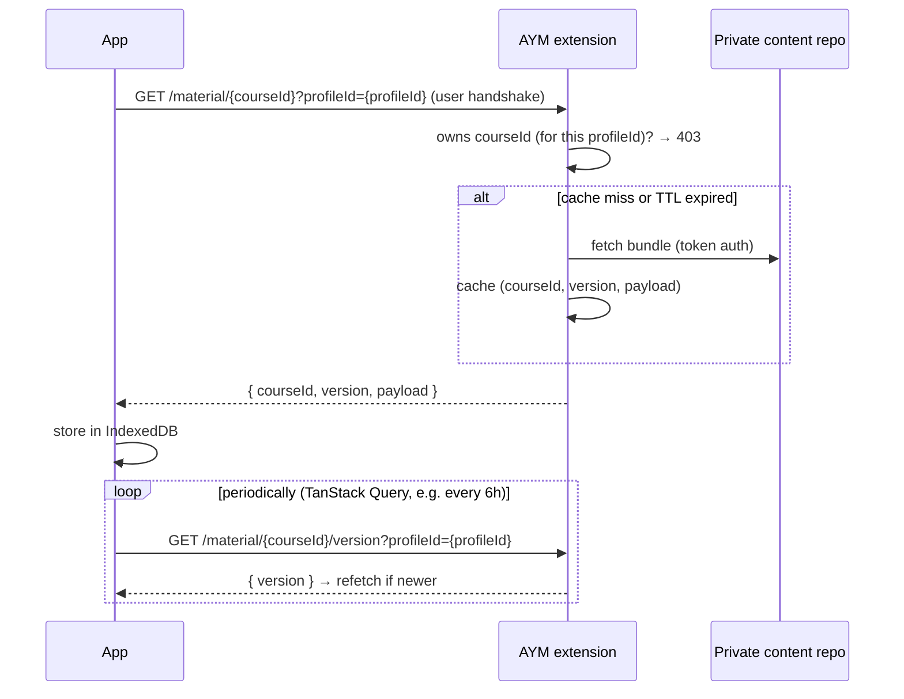
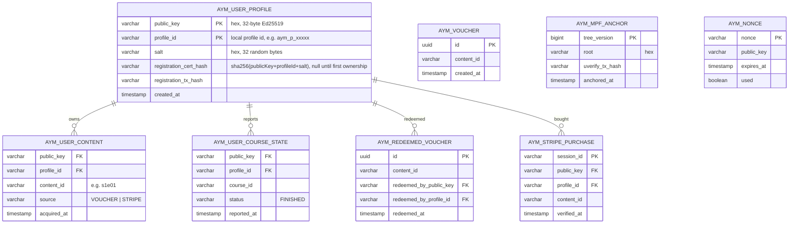

# UVerify Achievements & User Profile Platform — Implementation Plan

> **For agentic workers:** REQUIRED SUB-SKILL: Use superpowers:subagent-driven-development (recommended) or superpowers:executing-plans to implement this plan task-by-task. Steps use checkbox (`- [ ]`) syntax for tracking.

**Goal:** Give every AYM Vision user a self-custodied Cardano identity whose purchases (voucher or Stripe), course progress, and achievements are anchored on Cardano via UVerify — rendered as a public, verifiable profile/achievements certificate page.

**Architecture:** The AYM Vision PWA generates a 24-word Cardano keypair in localStorage and authenticates against a new **AYM UVerify backend extension** with an Ed25519 signature handshake (modeled after UVerify's user-state endpoint). The extension owns the source of truth (owned content, finished courses) in a **Merkle Patricia Forestry (MPF)** built with Cardano Client Lib; its root is notarized on UVerify every 48 h by the AYM master wallet. A custom UVerify certificate template (`aymProfile`) renders the profile by querying the extension (never from its own on-chain metadata) and verifying the MPF proof client-side.

**Tech Stack:** React 19 + Vite 7 + TypeScript (PWA) · `@scure/bip39` + `@stricahq/bip32ed25519` (frontend keys) · UVerify backend (Java 17 / Spring Boot) extension · Cardano Client Lib MPF + BouncyCastle Ed25519 · `stripe-java` · UVerify Java SDK (anchoring) · `@uverify/core` + `@aiken-lang/merkle-patricia-forestry` (template) · Vitest / JUnit 5.

## Global Constraints

- **No personal data on-chain, ever.** On-chain: only hashes (MPF roots, `sha256(publicKey + profileId + salt)`). Names etc. travel via URL params (UVerify URL-split pattern) or the extension API.
- **Keys never leave the device.** The mnemonic/private key is only in localStorage; the backend sees only the public key and signatures.
- **24-word backup appears after first ownership — skippable, persistent.** The backup prompt (write down 24 words + confirm randomly sampled words) appears immediately after the first successful voucher redeem or Stripe purchase. The content is already unlocked when the prompt appears — no blocking. The prompt is skippable but reappears on every subsequent purchase/redeem until confirmed.
- **Redeem/purchase are idempotent and ownership-guarded.** Backend rejects redeeming/buying content the user already owns; frontend hides buy/redeem for owned content (double protection).
- **Anchoring cadence:** MPF root goes on UVerify at most every 48 h and only if the root changed, signed by the AYM master wallet configured in the extension.
- **Template rule:** the `aymProfile` certificate template renders data fetched from the extension endpoint + MPF proof — not from its own certificate metadata. `uverify_template_id` values start lowercase (`aymProfile`, `aymAnchor`).
- **Signature handshake** mirrors the UVerify user-state pattern: server-issued single-use nonce (120 s TTL), Ed25519 signature over a canonical payload, verified server-side against the presented public key.
- **Existing app conventions:** course/content ids are episode ids like `s1e01` (see `src/gating/entitlements.ts`); profile persists under localStorage key `aym_user_profile`; purchases sit behind the existing parent lock (`src/settings/parentLock.ts`).
- **Kid safety / GDPR:** Stripe checkout and voucher creation are adult actions (parent-lock gated); certificate URLs containing names/salts are shareable secrets held by the user.
- **Operator guide is a required deliverable (Phase F).** Every env var, secret, third-party account (Stripe, GitHub PAT, Cardano wallet, UVerify), and manual human step must be documented in `docs/aym-operator-guide.md`. Any task that introduces new config MUST add it to the guide **in the same commit** — the guide can never lag the code.
- **Git-Workflow.** Die gesamte Umsetzung erfolgt auf einem einzigen Feature-Branch, niemals direkt auf `main`. Nach jeder Phase lokal testen (`npm run dev` bzw. Backend-Sandbox), bevor mit der nächsten Phase fortgefahren wird. Kein eigenständiges Öffnen oder Mergen eines Pull Requests – das Reviewen und Mergen übernimmt der Operator manuell, erst auf ausdrückliche Anweisung.

---

## 1. Architecture Overview

### 1.1 System context



### 1.2 Signature handshake (used by every authenticated call)

Identical shape for users and the AYM master key — only the key differs.



### 1.3 Voucher lifecycle



### 1.4 Stripe purchase



### 1.5 MPF anchoring & certificate verification



### 1.6 Course material delivery



### 1.7 Backend data model



**MPF leaf convention:** key = `blake2b-224(publicKey + profileId)` (hex) — derselbe Wert wird als `profileHash` für den öffentlichen Profil-Lookup wiederverwendet (§1.8). value = `sha256(canonicalJson({ ownedContent: sorted[], finishedCourses: sorted[] }))`, jeweils nur für dieses eine `(publicKey, profileId)`-Paar. Canonical JSON = sortierte Keys, kein Whitespace. Die Extension baut den Leaf bei jeder Ownership- oder Course-State-Änderung für das jeweilige Profil neu auf; `tree_version` erhöht sich pro Änderungs-Batch über alle Profile hinweg.

### 1.8 API contract (extension, all under `/api/v1/aym`)

| Endpoint | Auth | Request | Response |
|---|---|---|---|
| `POST /challenge` | none | `{ publicKey }` | `{ nonce, expiresAt }` |
| `GET /content?profileId=` | user handshake | `profileId` als Query-Parameter | `{ ownedContent: string[], finishedCourses: string[] }` — `404` falls `(publicKey, profileId)` unbekannt |
| `GET /content/{contentId}?profileId=` | user handshake | `profileId` als Query-Parameter | `{ owned: boolean }` (`false` falls unbekannt oder nicht Owner) |
| `POST /course-state` | user handshake | `{ courseId, status: "FINISHED", profileId }` | `{ finishedCourses }` |
| `POST /voucher/create` | **master** handshake | `{ contentId, count? }` | `{ vouchers: [{ id, contentId }] }` — unverändert, Voucher sind vor Einlösung nicht profilgebunden |
| `POST /voucher/redeem` | user handshake | `{ voucherId, profileId }` | `{ contentId, ownedContent, registrationCertificate? }` · `404` unbekannter Voucher · `409` bereits Owner (für dieses `profileId`) |
| `POST /purchase/stripe` | user handshake | `{ sessionId, profileId }` | `{ contentId, ownedContent, registrationCertificate? }` · `402` unbezahlt · `409` bereits Owner / Session bereits verwendet · `422` Key-Mismatch |
| `GET /material/{courseId}?profileId=` | user handshake | `profileId` als Query-Parameter | `{ courseId, version, payload }` · `403` nicht Owner |
| `GET /material/{courseId}/version?profileId=` | user handshake | `profileId` als Query-Parameter | `{ version }` |
| `GET /profile/{profileHash}` | none (public) | — | `{ profile: { ownedContent, finishedCourses, badgeCount }, mpf: { proof, root, treeVersion, anchorTxHash, anchoredAt } }` — `profileHash = blake2b-224(publicKey+profileId)`, identisch zum MPF-Leaf-Key |
| `GET /mpf/root` | none | — | `{ root, treeVersion, anchorTxHash, anchoredAt }` — unverändert, global über alle Profile |

`registrationCertificate` (einmalig zurückgegeben, bei erstem Besitz für dieses Profil): `{ hash, salt, verifyUrl }`, wobei `hash = sha256(publicKeyHex + profileId + saltHex)` und `verifyUrl = https://<ui>/verify/<hash>?pk=<publicKeyHex>&profileId=<profileId>&salt=<saltHex>`. Die App hängt clientseitig `&name=<chatName>` an (Name erreicht nie das Backend). Jedes lokale Profil bekommt sein eigenes Salt, seinen eigenen Hash und sein eigenes Zertifikat — Geschwister, die sich Gerät/Wallet teilen, bekommen getrennte, nicht vermischte Achievement-Seiten.

### 1.9 Repositories touched

| Repo | Role | Phases |
|---|---|---|
| `aym-vision-app` (this repo) | identity, backup UX, voucher/Stripe UX, material cache, entitlement sync, operator guide | A, D, F |
| `uverify-backend` fork/PR | AYM extension (handshake, vouchers, Stripe, MPF, scheduler, material proxy) | B |
| `aym-profile-template` (new, via `npx @uverify/cli init`) | `aymProfile` certificate template | C |
| `aym-vision-app/tools` | master-key admin CLI for voucher creation | E |

Each phase is independently shippable; B has no dependency on A besides the agreed API contract above (§1.8), which is the single source of truth for both sides.

---

## 2. Phase A — Frontend identity & backup (aym-vision-app)

### Task A1: Vitest setup

**Files:**
- Modify: `package.json` (add `vitest`, `@vitest/ui`, `jsdom`, `@testing-library/react`, script `"test": "vitest run"`)
- Create: `vitest.config.ts`

**Steps:**

- [ ] **Step 1: Install and configure**

```bash
npm i -D vitest jsdom @testing-library/react @testing-library/jest-dom
```

```ts
// vitest.config.ts
import { defineConfig } from 'vitest/config';

export default defineConfig({
  test: { environment: 'jsdom', globals: true },
});
```

Add to `package.json` scripts: `"test": "vitest run"`.

- [ ] **Step 2: Smoke test** — create `src/identity/__tests__/smoke.test.ts` with `expect(1 + 1).toBe(2)`, run `npm test`, expect PASS, then delete the smoke test in the same commit as Task A2's real tests (or keep until then).

- [ ] **Step 3: Commit** — `git commit -m "chore: add vitest test setup"`

### Task A2: Key generation, derivation, signing (`src/identity/keys.ts`)

**Files:**
- Create: `src/identity/keys.ts`
- Test: `src/identity/__tests__/keys.test.ts`

**Interfaces (Produces):**

```ts
export type AymIdentity = {
  mnemonic: string;          // 24 words, space-separated
  publicKeyHex: string;      // 32-byte Ed25519 public key, hex
};
export function generateIdentity(): AymIdentity;
export function restoreIdentity(mnemonic: string): AymIdentity;   // throws on invalid mnemonic
export function signPayload(mnemonic: string, payload: string): string; // 64-byte sig, hex
export function publicKeyHash(publicKeyHex: string): string;      // blake2b-224 hex (28 bytes)
```

Derivation: CIP-1852 path `m/1852'/1815'/0'/0/0` from the BIP39 entropy (Icarus). Dependencies: `@scure/bip39`, `@stricahq/bip32ed25519`, `@noble/hashes` (sha256, blake2b). **Before implementing, verify the exact `@stricahq/bip32ed25519` API via `npx ctx7@latest library "@stricahq/bip32ed25519" "derive CIP-1852 key from mnemonic entropy and sign"`.**

**Steps:**

- [ ] **Step 1: Write the failing tests**

```ts
// src/identity/__tests__/keys.test.ts
import { describe, it, expect } from 'vitest';
import { generateIdentity, restoreIdentity, signPayload, publicKeyHash } from '../keys';

describe('identity keys', () => {
  it('generates a 24-word mnemonic and 32-byte public key', () => {
    const id = generateIdentity();
    expect(id.mnemonic.split(' ')).toHaveLength(24);
    expect(id.publicKeyHex).toMatch(/^[0-9a-f]{64}$/);
  });

  it('restores the same public key from the same mnemonic', () => {
    const id = generateIdentity();
    expect(restoreIdentity(id.mnemonic).publicKeyHex).toBe(id.publicKeyHex);
  });

  it('throws on an invalid mnemonic', () => {
    expect(() => restoreIdentity('foo bar baz')).toThrow();
  });

  it('produces deterministic 64-byte signatures', () => {
    const id = generateIdentity();
    const sig = signPayload(id.mnemonic, 'AYM1|GET|/api/v1/aym/content|abc|d41d8c');
    expect(sig).toMatch(/^[0-9a-f]{128}$/);
    expect(signPayload(id.mnemonic, 'AYM1|GET|/api/v1/aym/content|abc|d41d8c')).toBe(sig);
  });

  it('computes a 28-byte blake2b public key hash', () => {
    const id = generateIdentity();
    expect(publicKeyHash(id.publicKeyHex)).toMatch(/^[0-9a-f]{56}$/);
  });
});
```

- [ ] **Step 2: Run** `npm test -- keys` — expect FAIL (module not found).

- [ ] **Step 3: Implement**

```bash
npm i @scure/bip39 @stricahq/bip32ed25519 @noble/hashes buffer
```

```ts
// src/identity/keys.ts
import { generateMnemonic, mnemonicToEntropy, validateMnemonic } from '@scure/bip39';
import { wordlist } from '@scure/bip39/wordlists/english';
import { Bip32PrivateKey } from '@stricahq/bip32ed25519';
import { blake2b } from '@noble/hashes/blake2b';
import { bytesToHex, hexToBytes } from '@noble/hashes/utils';
import { Buffer } from 'buffer';

export type AymIdentity = { mnemonic: string; publicKeyHex: string };

const HARDENED = 0x80000000;

function deriveKey(mnemonic: string) {
  const entropy = mnemonicToEntropy(mnemonic, wordlist);
  const root = Bip32PrivateKey.fromEntropy(Buffer.from(entropy));
  return root
    .derive(HARDENED + 1852)
    .derive(HARDENED + 1815)
    .derive(HARDENED + 0)
    .derive(0)
    .derive(0)
    .toPrivateKey();
}

export function generateIdentity(): AymIdentity {
  const mnemonic = generateMnemonic(wordlist, 256); // 256 bits → 24 words
  return restoreIdentity(mnemonic);
}

export function restoreIdentity(mnemonic: string): AymIdentity {
  if (!validateMnemonic(mnemonic.trim(), wordlist)) throw new Error('Invalid mnemonic');
  const key = deriveKey(mnemonic.trim());
  return { mnemonic: mnemonic.trim(), publicKeyHex: bytesToHex(key.toPublicKey().toBytes()) };
}

export function signPayload(mnemonic: string, payload: string): string {
  const key = deriveKey(mnemonic);
  return bytesToHex(key.sign(Buffer.from(payload, 'utf8')));
}

export function publicKeyHash(publicKeyHex: string): string {
  return bytesToHex(blake2b(hexToBytes(publicKeyHex), { dkLen: 28 }));
}
```

(Adjust method names to the verified `@stricahq/bip32ed25519` API — e.g. `toPublicKey().toBytes()` vs `.pubKey`. The tests above are API-agnostic.)

- [ ] **Step 4: Run** `npm test -- keys` — expect PASS.
- [ ] **Step 5: Commit** — `git commit -m "feat: Cardano identity keypair generation and signing"`

### Task A3: Identity storage & hook (`src/identity/storage.ts`, `useIdentity.tsx`)

**Files:**
- Create: `src/identity/storage.ts`, `src/identity/useIdentity.tsx`
- Test: `src/identity/__tests__/storage.test.ts`

**Interfaces (Produces):**

```ts
// storage.ts — localStorage key 'aym_identity'
export type StoredIdentity = AymIdentity & { backupConfirmedAt: number | null; createdAt: number };
export function loadIdentity(): StoredIdentity | null;
export function ensureIdentity(): StoredIdentity;      // creates + persists on first call (app start)
export function markBackupConfirmed(): StoredIdentity; // sets backupConfirmedAt = Date.now()
// useIdentity.tsx
export function useIdentity(): { identity: StoredIdentity; needsBackup: boolean; confirmBackup(): void };
```

**Steps:**

- [ ] **Step 1: Failing tests** — `ensureIdentity()` persists under `aym_identity` and returns the same key on the second call; `markBackupConfirmed()` sets a timestamp; corrupted JSON in storage regenerates instead of crashing (match the defensive try/catch style of `src/gating/entitlements.ts`).

```ts
import { describe, it, expect, beforeEach } from 'vitest';
import { ensureIdentity, loadIdentity, markBackupConfirmed } from '../storage';

describe('identity storage', () => {
  beforeEach(() => localStorage.clear());

  it('creates once and is stable across calls', () => {
    const a = ensureIdentity();
    const b = ensureIdentity();
    expect(b.publicKeyHex).toBe(a.publicKeyHex);
    expect(JSON.parse(localStorage.getItem('aym_identity')!)).toMatchObject({ publicKeyHex: a.publicKeyHex });
  });

  it('starts without backup confirmation and can confirm it', () => {
    expect(ensureIdentity().backupConfirmedAt).toBeNull();
    expect(markBackupConfirmed().backupConfirmedAt).toBeTypeOf('number');
  });

  it('recovers from corrupted storage', () => {
    localStorage.setItem('aym_identity', '{not json');
    expect(loadIdentity()).toBeNull();
    expect(() => ensureIdentity()).not.toThrow();
  });
});
```

- [ ] **Step 2: Run — FAIL.** **Step 3: Implement** (plain functions + a thin React hook wrapping them with `useSyncExternalStore` or state; call `ensureIdentity()` once in `src/App.tsx` bootstrap so the keypair exists from first launch). **Step 4: Run — PASS.**
- [ ] **Step 5: Commit** — `git commit -m "feat: persist app identity in localStorage, create on first launch"`

- [ ] **Step 6: Sicherheitslink mit identitätsbasiertem Schlüssel verschlüsseln**

  Ergänze in `src/identity/keys.ts`:

  ```ts
  export function deriveLinkEncryptionKey(mnemonic: string): Uint8Array;
  // HKDF-SHA256 über die BIP39-Entropiebytes, info = "aym-link-encryption", Länge 32 Bytes.
  // Gleiche 24 Wörter → gleicher Schlüssel → verschlüsselter Link ist auf jedem Gerät
  // nach Mnemonic-Wiederherstellung entschlüsselbar. Kein zweites Geheimnis nötig.
  ```

  Aktualisiere `src/common/transferLink.ts`:
  - Versionskennung im Link-Format: Präfix `v2:` = AES-256-GCM-verschlüsselt; kein Präfix = altes Format (bleibt lesbar, Rückwärtskompatibilität).
  - `buildTransferLink(mnemonic: string)` → verschlüsselt mit `deriveLinkEncryptionKey(mnemonic)` (bisher: `buildTransferLink()` ohne Parameter — Breaking Change).
  - `decodeTransferPayload(encoded: string, mnemonic?: string)` → bei Präfix `v2:` entschlüsseln; sonst altes Verhalten (Legacy-Links bleiben ohne Mnemonic lesbar).

  **Betroffene Aufrufstellen — müssen im selben Commit mitgeändert werden:**
  - `src/components/TransferExportPanel.tsx` Z. 22: `buildTransferLink()` → `buildTransferLink(loadIdentity()!.mnemonic)`
  - `src/pages/TransferPage.tsx`: alle Aufrufe von `buildTransferLink` und `decodeTransferPayload` prüfen, Mnemonic aus `loadIdentity()` ergänzen.

  Test: verschlüsselter Link mit falschem Mnemonic wirft Fehler; korrektes Mnemonic → Round-Trip korrekt; alter Link ohne Mnemonic dekodiert weiterhin.

  **Commit** — `git commit -m "feat: encrypt profile transfer link with identity-derived key (v2 format)"`

### Task A4: Backup prompt with word confirmation (`src/identity/BackupPrompt.tsx`)

**Files:**
- Create: `src/identity/BackupPrompt.tsx`, `src/identity/backupQuiz.ts`
- Test: `src/identity/__tests__/backupQuiz.test.ts`

**Interfaces (Produces):**

```ts
// backupQuiz.ts
export function pickQuizIndices(rng: () => number, count?: number): number[]; // 3 distinct indices 0..23
export function checkQuizAnswers(mnemonic: string, indices: number[], answers: string[]): boolean;
// BackupPrompt.tsx — modal flow: (1) show 24 numbered words, (2) ask for the 3 sampled words,
// (3) on success call markBackupConfirmed() and onDone(); onCancel: zurück, freundlicher Hinweis, kein Block.
// Erscheint NACH dem ersten erfolgreichen Kauf/Einlösen — NICHT davor, NICHT beim App-Start.
// Überspringbar; erscheint beim nächsten Kauf/Einlösen erneut bis bestätigt.
// Ton: Sicherheitsversprechen, kein Hindernis. Erste sichtbare Zeile: "Deine Daten gehören dir allein."
export function BackupPrompt(props: { onDone(): void; onCancel(): void }): JSX.Element;
```

**Steps:**

- [ ] **Step 1: Failing tests** for `backupQuiz.ts`: 3 distinct indices in range; `checkQuizAnswers` is case/whitespace-insensitive and rejects a wrong word.
- [ ] **Step 2: Run — FAIL.** **Step 3: Implement** quiz logic (inject `rng` for testability), then the `BackupPrompt` UI (two-step modal, i18n keys under `identity.backup.*` in `src/i18n`, print/write-down warning, no clipboard button for the full phrase). **Step 4: Run — PASS**; manually verify the modal with `npm run dev`.

  **UX/Copy-Vorgabe (bindend für die Implementierung):**
  - Prompt erscheint **nicht beim App-Start** und **nicht vor dem Kauf** — sondern unmittelbar nach dem ersten erfolgreichen Einlösen oder Kauf.
  - Der Inhalt ist bereits freigeschaltet, wenn der Prompt erscheint — kein Blockieren, kein Aufhalten.
  - Prompt ist **überspringbar** ("Später" / "Jetzt nicht"); erscheint beim nächsten Kauf/Einlösen erneut.
  - `onCancel`: zurück zur aufrufenden Seite, freundlicher Hinweis: "Tipp: Schreibe deine 24 Wörter auf, damit du deinen Fortschritt nie verlierst." Kein Fehler, kein Abbruch des Kaufs.
  - Erste sichtbare Zeile: **"Deine Daten gehören dir allein."**
  - Reihenfolge der Bildschirme: (1) Glückwunsch zur Freischaltung, (2) Erklärung warum die Wörter wichtig sind, (3) 24 Wörter anzeigen, (4) Wort-Bestätigung — oder Überspringen.
  - Kein "Du musst" / kein "Pflicht" — stattdessen: "Damit du immer Zugriff auf das hast, was dir gehört, schreib diese Wörter jetzt auf."

- [ ] **Step 5: Commit** — `git commit -m "feat: 24-word backup prompt with word confirmation quiz"`

- [ ] **Step 6: Demo-Build-Schalter ⚠️ Muss vor Tommi-Einreichung fertig sein**

  In `BackupPrompt.tsx` am Anfang der Komponente:
  ```ts
  if (import.meta.env.VITE_SKIP_BACKUP_GATE === 'true') {
    markBackupConfirmed();
    onDone();
    return null;
  }
  ```
  - `.env.demo` (Demo-Build-Konfiguration): `VITE_SKIP_BACKUP_GATE=true`
  - `.env.production` und `.env`: Diese Zeile darf **nicht existieren** — nicht leer, nicht `false`, schlicht nicht vorhanden.
  - Im Operator Guide (Task F1) unter "Demo-Builds" eintragen — siehe F1-Tabelle.

  **Commit** — `git commit -m "feat: demo build bypass for backup gate (VITE_SKIP_BACKUP_GATE)"`

### Task A5: Handshake client (`src/identity/handshake.ts`)

**Files:**
- Create: `src/identity/handshake.ts`
- Test: `src/identity/__tests__/handshake.test.ts`

**Interfaces (Produces):**

```ts
export function canonicalPayload(method: string, path: string, nonce: string, body?: string): string;
// "AYM1|" + METHOD + "|" + path + "|" + nonce + "|" + sha256Hex(body ?? "")
export async function aymFetch(path: string, init?: RequestInit): Promise<Response>;
// 1) POST {base}/api/v1/aym/challenge {publicKey} → nonce
// 2) sign canonicalPayload, 3) fetch with X-Aym-Public-Key / X-Aym-Nonce / X-Aym-Signature
// base URL from import.meta.env.VITE_AYM_BACKEND_URL
```

**Steps:**

- [ ] **Step 1: Failing tests**: `canonicalPayload('POST','/api/v1/aym/voucher/redeem','n1','{"voucherId":"x"}')` equals the exact expected string (hard-code the sha256 of the body in the test); `aymFetch` performs challenge-then-request (mock `fetch` with `vi.stubGlobal`, assert both calls and headers).
- [ ] **Step 2–4: Run FAIL → implement → PASS.**
- [ ] **Step 5: Commit** — `git commit -m "feat: signed handshake fetch client for AYM extension"`

**Ergänzung durch profileId-Scoping:** Bei POST-Aufrufen wandert `profileId` einfach als Feld in den Body — das ist über `sha256(body)` bereits Teil des signierten Payloads, keine Änderung an `canonicalPayload` nötig. Bei GET-Aufrufen (`/content`, `/content/{id}`, `/material/{courseId}`, `/material/{courseId}/version`) muss `profileId` als Teil des `path` in die Signatur eingehen (z. B. `path = '/api/v1/aym/content?profileId=' + profileId`), sonst könnte die profileId nachträglich unbemerkt ausgetauscht werden. `aymFetch` muss `profileId` deshalb grundsätzlich in die zu signierende Pfad-Zeichenkette einbauen, wenn es als Query-Parameter übergeben wird.

### Task A6: Restore identity from 24 words (`src/identity/RestoreIdentityModal.tsx`)

**Files:**
- Create: `src/identity/RestoreIdentityModal.tsx`
- Modify: `src/pages/AdultSettings.tsx` (Einstiegspunkt im Elternbereich)
- Test: `src/identity/__tests__/restoreIdentity.test.ts`

**Interfaces (Consumes):**

```ts
// Aus A2: restoreIdentity(mnemonic) — wirft bei ungültigem Mnemonic
// Aus A3: loadIdentity(), ensureIdentity(), markBackupConfirmed()
// Aus D1: refreshOwnership(profileId) — synct Ownership nach Restore
export function RestoreIdentityModal(props: { onDone(): void; onCancel(): void }): JSX.Element;
// Modal mit Texteingabe für 24 Wörter (Leerzeichen-getrennt oder einzeln).
// Nach erfolgreichem Restore: alte Identity in localStorage ersetzen, Ownership neu laden.
// Erreichbar ausschließlich im Elternbereich (AdultSettings) — kein Zugang aus dem Kind-Profil.
```

**Warum dieser Task nicht optional ist:** Die 24 Wörter sind das einzige Wiederherstellungsmittel bei Geräteverlust oder App-Deinstallation. Ohne diese UI sind sie wertlos — das Sicherheitsversprechen der App ist damit unvollständig.

**Steps:**

- [ ] **Step 1: Failing tests**

```ts
// src/identity/__tests__/restoreIdentity.test.ts
import { describe, it, expect, beforeEach } from 'vitest';
import { generateIdentity, restoreIdentity } from '../keys';
import { ensureIdentity, loadIdentity } from '../storage';

describe('restore identity', () => {
  beforeEach(() => localStorage.clear());

  it('restores the same public key from the original mnemonic', () => {
    const original = generateIdentity();
    const restored = restoreIdentity(original.mnemonic);
    expect(restored.publicKeyHex).toBe(original.publicKeyHex);
  });

  it('throws on an invalid mnemonic input', () => {
    expect(() => restoreIdentity('eins zwei drei')).toThrow();
  });

  it('after restore, loadIdentity returns the restored public key', () => {
    const original = ensureIdentity();
    const other = generateIdentity();
    // Simuliere Restore: überschreibe localStorage mit anderer Identity
    localStorage.setItem('aym_identity', JSON.stringify({
      ...other, backupConfirmedAt: Date.now(), createdAt: Date.now()
    }));
    expect(loadIdentity()!.publicKeyHex).toBe(other.publicKeyHex);
  });
});
```

- [ ] **Step 2: Run** `npm test -- restoreIdentity` — expect FAIL.

- [ ] **Step 3: Implement** `RestoreIdentityModal.tsx`:
  - Eingabe: Textarea für 24 Wörter (Leerzeichen- oder Zeilenumbruch-getrennt) oder 24 einzelne Felder (Implementierungsentscheidung — Textarea ist einfacher).
  - Validierung: `restoreIdentity(input.trim())` in try/catch — bei Fehler Fehlermeldung anzeigen, kein Fortschritt.
  - Bei Erfolg: `localStorage.setItem('aym_identity', JSON.stringify({ ...restoredIdentity, backupConfirmedAt: Date.now(), createdAt: Date.now() }))` → `refreshOwnership(activeProfileId)` für alle lokalen Profile → `onDone()`.
  - Warnhinweis vor der Eingabe: "Das ersetzt die aktuelle Identität auf diesem Gerät. Stelle sicher, dass du die richtigen 24 Wörter eingibst."
  - Einstiegspunkt in `AdultSettings.tsx` als eigener Bereich: "Identität wiederherstellen" — nur sichtbar, wenn eine gültige Identity bereits existiert (Geräte-Wechsel-Szenario) oder immer als Notfalloption.

- [ ] **Step 4: Run** `npm test -- restoreIdentity` — expect PASS. Manuell testen mit `npm run dev`: neues Mnemonic generieren, App zurücksetzen, mit altem Mnemonic wiederherstellen, Ownership prüfen.

- [ ] **Step 5: Commit** — `git commit -m "feat: restore identity from 24-word mnemonic in adult settings"`

---

## 3. Phase B — UVerify backend extension (uverify-backend fork)

> Follow the layout of the existing `tokenizable-certificate` extension in `uverify-backend` so the module registers in `GET /api/v1/extensions` as `"aym-vision"` and can be toggled via config. Package root: `io.uverify.extension.aymvision`. All tables prefixed `aym_` (Flyway migration). Config (`application.yml`): `aym.master-public-key`, `aym.stripe.api-key`, `aym.stripe.products` (map price/product id → contentId), `aym.content-repo.url/token/cache-ttl`, `aym.mpf.db-path`, `aym.anchor.interval-hours: 48`, `aym.anchor.wallet-mnemonic`, `aym.ui-base-url`. Every key added here must land in the operator guide (Phase F) in the same commit.

### Task B1: Handshake filter + nonce store

**Files:**
- Create: `.../aymvision/auth/ChallengeController.java`, `HandshakeService.java`, `NonceEntity.java`, `NonceRepository.java`
- Test: `.../aymvision/auth/HandshakeServiceTest.java`

**Interfaces (Produces):**

```java
public record HandshakeResult(String publicKeyHex) {}
public class HandshakeService {
    /** Throws InvalidHandshakeException (→ 401) on any failure. Marks nonce used. */
    public HandshakeResult verify(String publicKeyHex, String nonce, String signatureHex,
                                  String method, String path, byte[] body);
    public String issueNonce(String publicKeyHex); // 32B random hex, TTL 120s
    public boolean isMasterKey(String publicKeyHex); // equals aym.master-public-key
}
```

**Steps:**

- [ ] **Step 1: Failing tests** (JUnit 5): valid signature accepted (generate an in-test Ed25519 keypair with BouncyCastle, sign `"AYM1|GET|/api/v1/aym/content|<nonce>|<sha256(empty)>"`); expired nonce rejected; reused nonce rejected; tampered payload rejected; `isMasterKey` matches config.
- [ ] **Step 2: Run** `mvn -pl <extension-module> test` — FAIL.
- [ ] **Step 3: Implement** with `org.bouncycastle.crypto.signers.Ed25519Signer` / `Ed25519PublicKeyParameters`; nonce in `aym_nonce` table (or Caffeine cache) with used-flag; scheduled cleanup of expired rows.

```java
public boolean verifySignature(byte[] publicKey, byte[] payload, byte[] signature) {
    var verifier = new Ed25519Signer();
    verifier.init(false, new Ed25519PublicKeyParameters(publicKey, 0));
    verifier.update(payload, 0, payload.length);
    return verifier.verifySignature(signature);
}
```

- [ ] **Step 4: PASS.** **Step 5: Commit** — `feat(aym): nonce challenge + Ed25519 handshake verification`

### Task B2: User registry + content endpoints

**Files:**
- Create: `.../aymvision/user/AymUserProfileEntity.java`, `AymUserContentEntity.java`, repositories, `ContentService.java`, `ContentController.java`; Flyway `V<next>__aym_tables.sql` (all §1.7 tables)
- Test: `ContentServiceTest.java`, `ContentControllerIT.java`

**Interfaces (Produces):**

```java
public class ContentService {
    public Optional<UserContent> getContent(String publicKeyHex, String profileId);         // owned + finished
    public boolean owns(String publicKeyHex, String profileId, String contentId);
    public UserContent grantContent(String publicKeyHex, String profileId, String contentId, Source source);
        // creates AYM_USER_PROFILE row (public_key, profile_id, mit zufälligem 32B-Salt) falls nicht vorhanden;
        // wirft AlreadyOwnedException (→409), Prüfung scoped auf (publicKey, profileId)
    public UserContent reportCourseState(String publicKeyHex, String profileId, String courseId, String status);
}
```

**Steps:**

- [ ] **Step 1: Failing tests**: unknown user → `GET /content?profileId=` 404 and `GET /content/{id}?profileId=` returns `{"owned": false}`; grant then `owns` true; double-grant throws `AlreadyOwnedException`; grant creates user profile row with 32-byte salt; **derselbe `publicKey` mit zwei verschiedenen `profileId`s sind unabhängig — ein Grant für Profil A darf `owns()` für Profil B unter derselben Wallet nicht beeinflussen.**
- [ ] **Step 2–4: FAIL → implement (controller guarded by `HandshakeService.verify`) → PASS.**
- [ ] **Step 5: Commit** — `feat(aym): user registry and signed content endpoints`

### Task B3: Voucher create/redeem

**Files:**
- Create: `.../aymvision/voucher/VoucherEntity.java`, `RedeemedVoucherEntity.java`, repositories, `VoucherService.java`, `VoucherController.java`
- Test: `VoucherServiceTest.java`

**Interfaces (Produces):**

```java
public class VoucherService {
    public List<Voucher> create(String contentId, int count);      // master-only at controller level
    /** @Transactional: delete voucher, insert redeemed row (public_key, profile_id),
        grantContent, bump MPF-Leaf für (publicKey, profileId). */
    public RedeemResult redeem(String publicKeyHex, String profileId, UUID voucherId);
        // VoucherNotFoundException (→404), AlreadyOwnedException (→409, scoped auf profileId)
}
public record RedeemResult(String contentId, List<String> ownedContent,
                           RegistrationCertificate registrationCertificate /* null außer bei erstem Besitz für dieses profileId */) {}
```

**Steps:**

- [ ] **Step 1: Failing tests**: create returns UUIDs persisted with contentId; redeem moves the row (`aym_voucher` empty, `aym_redeemed_voucher` has it) and grants content; redeeming twice → 404; redeeming a second voucher for owned content (same profileId) → 409 **and** the voucher row survives (rollback); controller rejects non-master `create` (403); **zwei unterschiedliche Voucher für denselben `contentId`, eingelöst unter zwei unterschiedlichen `profileId`s derselben Wallet, müssen beide erfolgreich sein (Geschwister-Fall) — darf NICHT `AlreadyOwnedException` werfen.**
- [ ] **Step 2–4: FAIL → implement → PASS.** **Step 5: Commit** — `feat(aym): voucher creation (master) and atomic redemption`

### Task B4: Stripe purchase verification

**Files:**
- Create: `.../aymvision/stripe/StripePurchaseService.java`, `StripePurchaseController.java`, `StripePurchaseEntity.java` + repository
- Test: `StripePurchaseServiceTest.java` (mock `com.stripe.model.checkout.Session` retrieval behind a seam `StripeGateway`)

**Interfaces (Produces):**

```java
public interface StripeGateway { CheckoutInfo retrieveSession(String sessionId); }
public record CheckoutInfo(String sessionId, String paymentStatus, String clientReferenceId, String productId) {}
public class StripePurchaseService {
    /** Validiert: paid + clientReferenceId == blake2b224(publicKey+profileId) [= profileHash]
        + Session unbenutzt + Produkt gemappt + nicht bereits Owner (scoped auf profileId). */
    public RedeemResult verifyAndGrant(String publicKeyHex, String profileId, String sessionId);
        // PaymentRequiredException (→402), KeyMismatchException (→422),
        // SessionAlreadyUsedException / AlreadyOwnedException (→409)
}
```

**Steps:**

- [ ] **Step 1: Failing tests**: happy path grants mapped contentId and stores session id; `payment_status != paid` → 402; `client_reference_id` ≠ caller's `profileHash` (`blake2b224(publicKey+profileId)`) → 422; same session id twice → 409; unmapped product → 422.
- [ ] **Step 2–4: FAIL → implement (`stripe-java`, product→contentId map from `aym.stripe.products`) → PASS.**
- [ ] **Step 5: Commit** — `feat(aym): Stripe checkout session verification and content grant`

### Task B5: MPF service (Cardano Client Lib)

**Files:**
- Create: `.../aymvision/mpf/MpfService.java`, `MpfLeaf.java`, `AymMpfAnchorEntity.java` + repository
- Test: `MpfServiceTest.java`

> **CCL MPF — use these exact coordinates** (docs: <https://cardano-client.dev/docs/preview/mpftrie/overview>):
>
> ```gradle
> implementation 'com.bloxbean.cardano:merkle-patricia-forestry:0.8.0-preview1'
> implementation 'com.bloxbean.cardano:merkle-patricia-forestry-rocksdb:0.8.0-preview1'
> ```
>
> Primary API: `com.bloxbean.cardano.vds.mpf.MpfTrie` — `put(byte[] key, byte[] value)`, `get`, `delete`, `getRootHash()`, `getProofPlutusData(byte[] key)` (Plutus `ListPlutusData` proofs, verifiable by Aiken's on-chain MPF library), `getProofWire(byte[] key)` (wire format). Persistence: `com.bloxbean.cardano.vds.mpf.rocksdb.RocksDbNodeStore` (embedded RocksDB, atomic `withBatch`). Hashing is Blake2b-256, compatible with `aiken-lang/merkle-patricia-forestry`. Still wrap everything behind `MpfService` so the rest of the extension is insulated from the preview API.

**Interfaces (Produces):**

```java
public class MpfService {
    /** Baut den Leaf für ein Profil neu: key = blake2b224(publicKey + profileId) [= profileHash],
        value = sha256(canonicalJson(owned, finished)) nur für dieses eine Profil. */
    public synchronized long upsertLeaf(String publicKeyHex, String profileId, List<String> owned, List<String> finished);
        // gibt neue treeVersion zurück (erhöht sich nur wenn sich die Root ändert)
    public String currentRoot();          // hex, global über alle Profile
    public long currentTreeVersion();
    public MpfProof proofFor(String profileHash);   // serialisierte Proof-Steps für JS-Verifikation
}
public record MpfProof(String proofJson, String root, long treeVersion) {}
```

**Steps:**

- [ ] **Step 1: Failing tests**: inserting a leaf changes the root; same data twice keeps root and version stable; proof for an included key verifies against the root (round-trip through CCL's own verifier); canonical JSON is order-independent (`["b","a"]` input → same value hash as `["a","b"]`); **zwei verschiedene `profileId`s unter demselben `publicKey` erzeugen zwei unabhängige Leaves mit unterschiedlichen Keys/Values.**
- [ ] **Step 2–4: FAIL → implement → PASS.** Use `MpfTrie` over `RocksDbNodeStore` (RocksDB path from config `aym.mpf.db-path`); additionally persist leaves in the SQL DB so the trie can be rebuilt from scratch on boot or store migration. Serve proofs from `getProofWire` (plus `getProofPlutusData` hex for on-chain use); confirm the JS `@aiken-lang/merkle-patricia-forestry` verifier consumes the wire format — if not, add the translation in `MpfService` (never in the template).
- [ ] **Step 5: Commit** — `feat(aym): MPF over user content state with proofs`
- [ ] **Step 6: Wire** `ContentService.grantContent` / `reportCourseState` → `MpfService.upsertLeaf` (adjust B2/B3/B4 tests to assert the tree version bumps). Commit — `feat(aym): keep MPF in sync with ownership changes`

### Task B6: Anchor scheduler + registration certificates (UVerify Java SDK)

**Files:**
- Create: `.../aymvision/anchor/AnchorScheduler.java`, `UVerifyIssuer.java`, `.../aymvision/user/RegistrationCertificateService.java`
- Test: `AnchorSchedulerTest.java`, `RegistrationCertificateServiceTest.java` (mock `UVerifyIssuer`)

**Interfaces (Produces):**

```java
public interface UVerifyIssuer { String issue(String hashHex, Map<String, Object> metadata); } // unverändert
public class AnchorScheduler {
    @Scheduled(fixedDelayString = "${aym.anchor.interval-ms:172800000}") // 48h, unverändert —
    public void anchorIfChanged();                                       // verankert die globale Root über alle Profile
    // wenn currentRoot != letzte AymMpfAnchor.root → Zertifikat ausstellen:
    //   hash = root, metadata = { uverify_template_id: "aymAnchor", tree_version, previous_root }
    //   speichert AymMpfAnchor(treeVersion, root, txHash, now)
}
public class RegistrationCertificateService {
    /** Wird bei erstem Besitz für ein (publicKey, profileId) aufgerufen:
        hash = sha256(publicKeyHex + profileId + saltHex),
        metadata = { uverify_template_id: "aymProfile", uverify_update_policy: "first" }.
        Gibt { hash, salt, verifyUrl } für RedeemResult.registrationCertificate zurück.
        Jedes lokale Profil bekommt sein eigenes Salt/Hash. */
    public RegistrationCertificate register(String publicKeyHex, String profileId);
}
```

**Steps:**

- [ ] **Step 1: Failing tests**: scheduler issues exactly once when root changed and never when unchanged; anchor row persisted with txHash; registration cert hash equals `sha256(pk + profileId + salt)` recomputed in test; `verifyUrl` = `{aym.ui-base-url}/verify/{hash}?pk={pk}&profileId={profileId}&salt={salt}`; ein zweiter Grant für DASSELBE `(publicKey, profileId)` registriert nicht erneut; ein Grant für ein ANDERES `profileId` unter derselben Wallet registriert dagegen separat und neu.
- [ ] **Step 2–4: FAIL → implement `UVerifyIssuer` with `io.uverify:uverify-sdk` (`UVerifyClient` with `signTx` from a CCL `Account(aym.anchor.wallet-mnemonic)`, `baseUrl` = own backend) → PASS.**
- [ ] **Step 5: Commit** — `feat(aym): 48h MPF root anchoring and first-ownership registration certificates`

### Task B7: Public profile endpoint + material proxy

**Files:**
- Create: `.../aymvision/profile/ProfileController.java`, `.../aymvision/material/MaterialService.java`, `MaterialController.java`
- Test: `ProfileControllerIT.java`, `MaterialServiceTest.java`

**Interfaces (Produces):** the `GET /profile/{profileHash}` and `GET /material/*` contracts from §1.8. `MaterialService` caches repo bundles (Caffeine, TTL `aym.content-repo.cache-ttl`) and fetches `{aym.content-repo.url}/{courseId}/bundle.json` with `Authorization: Bearer {token}`.

**Steps:**

- [ ] **Step 1: Failing tests**: profile of unknown hash → 404; known user → profile + proof + anchor info (anchorTxHash null when tree version newer than last anchor); material for non-owner → 403; cache hit does not re-fetch (mock HTTP seam, verify single call); expired TTL re-fetches; `/version` returns bundle version without payload.
- [ ] **Step 2–4: FAIL → implement → PASS.** **Step 5: Commit** — `feat(aym): public profile endpoint and cached course material proxy`
- [ ] **Step 6: End-to-end sandbox check** (uverify-examples): `uv run sandbox.py start`, run the extension against the devnet, walk voucher create → redeem → profile → anchor via Swagger. Document the walkthrough in the extension README. Commit.

---

## 4. Phase C — `aymProfile` certificate template

### Task C1: Scaffold + profile rendering

**Files:**
- Create (new repo `aym-profile-template` via `npx @uverify/cli init aym-profile-template`): `src/Certificate.tsx`, `src/profileApi.ts`
- Test: dev preview + unit tests for pure helpers (`src/verifyParams.ts`)

**Interfaces (Consumes):** §1.8 `GET /profile/{profileHash}`; UVerify `Template` API (`render(hash, metadata, certificate, pagination, extra)`).

**Steps:**

- [ ] **Step 1: Failing test** for `verifyParams.ts`: `matchesCertificate(hash, pk, profileId, salt)` returns true iff `sha256(pk + profileId + salt) === hash` (fixture vector precomputed in the test); returns false for missing params.
- [ ] **Step 2–3: FAIL → implement template:**

```tsx
export default class AymProfile extends Template {
  public name = 'AymProfile';
  public defaultUpdatePolicy = 'first' as const;

  constructor() {
    super();
    this.theme = { background: 'bg-gradient-to-br from-violet-900 to-sky-700' };
    this.layoutMetadata = {}; // intentionally empty — data comes from the extension, not metadata
  }

  public render(hash, metadata, certificate, pagination, extra) {
    // 1. guard: extra.isLoading / extra.serverError
    // 2. read pk, profileId, salt, name from UVerifyConfig.searchParams
    // 3. matchesCertificate(hash, pk, profileId, salt) — else render "invalid link" state
    // 4. profileHash = blake2b224(pk + profileId)
    // 5. useQuery → GET {backendUrl}/api/v1/aym/profile/{profileHash}
    // 6. verify proof with @aiken-lang/merkle-patricia-forestry against returned root
    // 7. render: name (URL param only), badges/coins summary, owned courses,
    //    finished courses, anchor status: "✓ anchored <date> (tx …)" or "⏳ pending next anchor"
    //    + link to the aymAnchor certificate page for the root
  }
}
```

- [ ] **Step 4:** Register in sandbox: `uv run sandbox.py template add AymProfile && uv run sandbox.py restart`; open a redeemed user's `verifyUrl` and confirm all six render states (loading, server error, invalid link, unverified proof, pending anchor, anchored).
- [ ] **Step 5: Commit.** For production later: PR to `UVerify-io/uverify-ui` `additional-templates.json` (repository entry, pinned commit).

### Task C2: `aymAnchor` template (minimal)

Same repo. Renders an anchor certificate: tree version, root (monospace), issued-by master wallet card, link back to docs. One task: failing snapshot-ish test for its params parsing → implement → sandbox check → commit.

---

## 5. Phase D — Frontend commerce & sync (aym-vision-app)

### Task D1: Ownership store + entitlement sync

**Files:**
- Create: `src/shop/ownership.ts`
- Test: `src/shop/__tests__/ownership.test.ts`

**Interfaces (Produces / Consumes):**

```ts
export async function refreshOwnership(profileId: string): Promise<string[]>;
// aymFetch GET /content?profileId={profileId} → für jede contentId: unlockEpisodePaywallOnly(contentId)
// persistiert die letzte bekannte Liste unter localStorage 'aym_p_{profileId}__aym_owned_content' für Offline —
// scoped pro lokalem Profil, nicht mehr geräteweit
export function isOwnedLocally(profileId: string, contentId: string): boolean;
```

**Steps:** failing tests (mock `aymFetch`: 404 → empty + no entitlement writes; owned list → entitlements updated, cache written under `aym_p_{profileId}__aym_owned_content`; offline (fetch throws) → falls back to cached list for that profileId) → implement → PASS → commit `feat: sync owned content into episode entitlements`.

### Task D2: Voucher redeem UI (QR + manual)

**Files:**
- Create: `src/shop/RedeemVoucher.tsx`, `src/shop/qrScanner.ts`
- Modify: route in `src/App.tsx`, entry point on `src/pages/Profile.tsx`

**Steps:**

- [ ] **Step 1:** `qrScanner.ts`: prefer native `BarcodeDetector`; fallback `npm i @zxing/browser`. Unit-test the UUID extraction/validation (`parseVoucherInput` accepts a raw UUID or a URL containing one; rejects garbage) — failing test first.
- [ ] **Step 2:** Implement `RedeemVoucher.tsx`: camera scan or text input → Bestätigungsfenster ("Du willst jetzt [Episodentitel] freischalten — stimmt das?" Ja / Nein) → `aymFetch POST /voucher/redeem { voucherId, profileId: activeProfileId }` → success: coin-style celebration (reuse `src/progress/rewardFx.tsx`), `refreshOwnership(activeProfileId)` → danach BackupPrompt anzeigen falls `useIdentity().needsBackup` (überspringbar; `onCancel`: zurück, freundlicher Hinweis, Prompt erscheint beim nächsten Einlösen erneut); 409 → friendly "already yours" message; if response contains `registrationCertificate`, store `{hash, salt, verifyUrl}` under localStorage `aym_p_{activeProfileId}__aym_registration_cert` and show a "your profile certificate" share card (append `&name=<chatName>` client-side).

  **Kinderschutz-Hinweis:** Kein Eltern-PIN für die Einlösung — der Code ist eine 36-stellige Zufallsfolge (UUID), die nur ein Elternteil beschaffen kann. Das Kind löst ein, was der Elternteil besorgt hat. Das Bestätigungsfenster ("stimmt das?") verhindert versehentliche Einlösungen und stellt sicher, dass das Kind versteht, was gerade passiert.

- [ ] **Step 3:** Manual verification via `npm run dev` (camera + manual path, Bestätigungsfenster, BackupPrompt nach Erfolg). Commit — `feat: voucher redemption with QR scanner, confirmation screen and post-redeem backup prompt`.

### Task D3: Stripe purchase flow

**Files:**
- Create: `src/shop/BuyContent.tsx`, `src/shop/stripe.ts`
- Test: `src/shop/__tests__/stripe.test.ts`

**Steps:**

- [ ] **Step 1: Failing tests** for `stripe.ts`: `paymentLinkFor(contentId, profileHash)` builds `{VITE_STRIPE_LINK_BASE[contentId]}?client_reference_id={profileHash}` where `profileHash = blake2b224(publicKey + activeProfileId)` (must match the backend value exactly); `extractSessionId(returnUrl)` parses `session_id` from the success redirect; both reject unknown content ids.
- [ ] **Step 2: Implement** `BuyContent.tsx`: hidden behind parent lock (`src/settings/parentLock.ts`); disabled with "already owned" when `isOwnedLocally(activeProfileId, contentId)` (double-purchase prevention, frontend side); opens the payment link with `profileHash` as `client_reference_id`; on return route (`/shop/return?session_id=…`) posts `{ sessionId, profileId: activeProfileId }` via `aymFetch POST /purchase/stripe`, then `refreshOwnership(activeProfileId)` → danach BackupPrompt anzeigen falls `useIdentity().needsBackup` (überspringbar; `onCancel`: zurück zur aufrufenden Seite, freundlicher Hinweis "Tipp: Schreibe deine 24 Wörter auf, damit du deinen Fortschritt nie verlierst", Prompt erscheint beim nächsten Kauf erneut); handles 402/409/422 with distinct i18n messages.
- [ ] **Step 3: PASS + manual dev check → commit** — `feat: Stripe checkout flow with signed receipt verification`.

### Task D4: Course material cache + update polling

**Files:**
- Create: `src/shop/materialCache.ts`, `src/shop/useCourseMaterial.ts`
- Test: `src/shop/__tests__/materialCache.test.ts`

**Steps:**

- [ ] **Step 1: Failing tests** (`fake-indexeddb` dev-dep): `getMaterial(courseId)` returns cached bundle without network when present; fetches + stores on miss; `checkForUpdate(courseId)` refetches only when server version > cached version.
- [ ] **Step 2: Implement**: IndexedDB store `aym-material` (idb-keyval or raw API); `useCourseMaterial` = TanStack Query wrapper (`staleTime: 6h`) calling `GET /material/{id}/version?profileId={profileId}` and refetching the bundle on change; 403 clears local entitlement for that course and triggers `refreshOwnership(activeProfileId)`.
- [ ] **Step 3: PASS → commit** — `feat: offline course material cache with version polling`.

### Task D5: Profile page integration

**Files:**
- Modify: `src/pages/Profile.tsx`

**Steps:**

- [ ] **Step 1: Blockchain-Profil-Karte** — Wenn `aym_p_{activeProfileId}__aym_registration_cert` existiert, Karte in `Profile.tsx` anzeigen mit:
  - QR-Code (`qrcode` dep) der vollständigen `verifyUrl&name=chatName`.
  - **"Link kopieren"-Button** (kopiert die volle URL in die Zwischenablage). **Kein SMS-Share-Button** — die URL ist 250+ Zeichen lang und wird von SMS-Anbietern abgeschnitten. Bewusste Entscheidung: Teilen ausschließlich per QR-Code oder Kopieren-Button.
  - Commit — `feat: profile page shows blockchain certificate card with QR and copy-link button`.

- [ ] **Step 2: Ankerstatus anzeigen** — `GET /mpf/root` abfragen, Ergebnis mit `profile.mpf.treeVersion` vergleichen: bei Übereinstimmung "✓ Auf der Blockchain gesichert (Datum, tx …)", sonst "⏳ Sicherung ausstehend — kann bis zu 48 Stunden dauern". Commit — `feat: show blockchain anchor status on profile page`.

- [ ] **Step 3: Kursabschlüsse melden** — In `src/progress/progressEngine.ts` an der Stelle `episodeJustCompletedNow === true` einhängen: `aymFetch POST /course-state { courseId, status: "FINISHED", profileId: activeProfileId }`. Fehler still loggen — nie den Abschluss-Flow blockieren. Manual verification + commit — `feat: report finished courses to UVerify backend`.

### Task D6: Story-Inhalte aus dem öffentlichen Bundle entfernen

**Hintergrund:** Aktuell liegen alle Episoden-Inhalte als TypeScript-Dateien direkt im
öffentlichen PWA-Repo (`src/story-v02/content/de/*.ts`, `en/*.ts`). Sie werden statisch
ins JavaScript-Bundle kompiliert — jeder kann sie ohne Login oder Kauf lesen.
Task D6 schließt diese Lücke: Inhalte wandern ins private Content-Repo, die App lädt
sie nur noch über das Backend (D4-Infrastruktur), und die `.ts`-Dateien werden gelöscht.

**Files:**
- Delete: `src/story-v02/content/de/s1e01.de.ts` … `s1e05.de.ts` (und `en/`)
- Modify: `src/story-v02/content/getPlayableEpisodeV02.ts`
- Extern: privates Content-Repo erhält `s1e01/bundle.json` … `s1e05/bundle.json`

**Voraussetzung:** D4 (materialCache + useCourseMaterial) muss fertig und deployed sein,
bevor dieser Task commitet wird — sonst bricht das Laden der Episoden.

**Steps:**

- [ ] **Step 1: Bundle-Format festlegen** — `bundle.json` enthält das serialisierte Episoden-Objekt:
  ```json
  {
    "version": "1.0.0",
    "payload": "<JSON.stringify des bisherigen TypeScript-Default-Exports, base64-kodiert>"
  }
  ```
  Schreibe ein einmaliges Migrations-Skript (`tools/migrate-content.ts`), das die
  bestehenden TS-Exporte einliest und pro Episode eine `bundle.json` ausgibt.

- [ ] **Step 2: Migration ausführen** — Skript lokal ausführen, Output-Dateien ins
  private Content-Repo legen, committen und pushen.

- [ ] **Step 3: `getPlayableEpisodeV02.ts` umschreiben** — statt statischer `import()`:
  ```ts
  export async function getPlayableEpisode(episodeId: string, profileId: string) {
    const bundle = await getMaterial(episodeId, profileId); // aus D4: materialCache
    if (!bundle) throw new Error('Content not available');
    return JSON.parse(atob(bundle.payload));
  }
  ```
  Fehlerfall 403 (nicht im Besitz): bestehenden Gating-Flow unverändert lassen —
  `refreshOwnership` aus D1 sorgt dafür, dass die Entitlement-Daten aktuell sind.

- [ ] **Step 4: Failing test** — `getPlayableEpisode('s1e01', 'p1')` gibt das
  deserialisierte Episoden-Objekt zurück wenn `getMaterial` ein Bundle liefert;
  wirft wenn `getMaterial` null zurückgibt. Mock `getMaterial`.
  Run — FAIL.

- [ ] **Step 5: Run — PASS.**

- [ ] **Step 6: Story-Dateien aus dem öffentlichen Repo löschen**
  ```bash
  git rm src/story-v02/content/de/*.ts src/story-v02/content/en/*.ts
  ```
  Sicherstellen, dass kein anderer Import noch auf diese Dateien zeigt (`grep -r "s1e0" src/`).

- [ ] **Step 7: Commit** — `feat: move episode content to private repo, remove from public bundle`

  **⚠️ Nach diesem Commit sind die Inhalte ohne laufendes Backend nicht mehr spielbar.**
  Lokal testen mit `VITE_AYM_BACKEND_URL=http://localhost:9090 npm run dev`
  und einem Testnutzer mit gültigem Voucher.

---

## 6. Phase E — Master tooling (voucher admin)

### Task E1: Voucher creation CLI

**Files:**
- Create: `tools/aym-admin/create-vouchers.ts` (+ `tools/aym-admin/package.json`, reuses `src/identity/keys.ts` logic via a small copy or workspace import)
- Test: `tools/aym-admin/__tests__/cli.test.ts`

**Steps:**

- [ ] **Step 1: Failing test**: given `--content s1e04 --count 3`, the CLI calls challenge + create with a master-key signature and writes `vouchers-s1e04.csv` plus one QR PNG per UUID (mock the HTTP layer; assert canonical payload format matches Task A5's).
- [ ] **Step 2: Implement**: master mnemonic from `AYM_MASTER_MNEMONIC` env (never a file), `qrcode` for PNGs, prints redeem URLs (`https://<app>/redeem?voucher=<uuid>`).
- [ ] **Step 3: PASS → commit** — `feat: master-key voucher creation CLI with QR export`.

---

## 7. Phase F — Operator & setup guide (required deliverable)

### Task F1: `docs/aym-operator-guide.md`

**Files:**
- Create: `docs/aym-operator-guide.md` (this repo) — started in Phase B's first task and extended by every task that adds config; finalized here.

The guide is written for a human operator (the AYM Vision developer) with zero prior context. It MUST contain the three parts below. The executing agent collects the values it can and leaves clearly marked `⚠️ HUMAN STEP` boxes for everything only a human can do (account signup, payment details, secret provisioning).

**Part 1 — Accounts & human steps (step-by-step, in order):**

1. **Stripe** (<https://dashboard.stripe.com>): create/activate an account (business details, payout account — human step). Then per purchasable `contentId`: create a Product + Price, and a Payment Link whose success URL is `https://<app-domain>/shop/return?session_id={CHECKOUT_SESSION_ID}`; note that the app appends `?client_reference_id=<profileHash>` when opening the link. Create a **restricted API key** (read access to Checkout Sessions only — never the full secret key). Record the product/price id → `contentId` mapping for `aym.stripe.products`.
2. **GitHub private content repo**: create the private repo the extension crawls (course bundles at `/{courseId}/bundle.json`). Create a **fine-grained personal access token**: read-only, `Contents` permission, scoped to that single repo, with an expiry — document the rotation procedure (where it's deployed, how to swap it without downtime).
3. **Cardano master wallet**: generate a 24-word mnemonic offline (human step, stored in a password manager / secret store, never in git). It serves both roles: anchor-signing wallet (`aym.anchor.wallet-mnemonic`) and master handshake key (its derived public key → `aym.master-public-key`, derivation path `m/1852'/1815'/0'/0/0` as in Task A2). Fund it: preprod faucet for staging, real ada on mainnet (budget note: one anchor tx every ≤48 h).
4. **UVerify**: choose self-hosted backend (extension runs inside it) vs. app.uverify.io with a **Bootstrap Datum** (white-label fees/batches — request via hello@uverify.io or Discord, human step). Register the `aymProfile`/`aymAnchor` templates: sandbox via `sandbox.py template add`, production via PR to `UVerify-io/uverify-ui` `additional-templates.json`.
5. **Hosting/domains**: final URLs for the app and the backend (feed `aym.ui-base-url`, `VITE_AYM_BACKEND_URL`, Stripe success URLs, CORS config).

**Part 2 — Complete configuration reference (one table, no omissions):**

| Variable | Component | Secret | Source |
|---|---|---|---|
| `aym.master-public-key` | backend | no | derived from master mnemonic (step 3) |
| `aym.anchor.wallet-mnemonic` | backend | **yes** | master wallet (step 3), inject via env/secret store |
| `aym.anchor.interval-ms` | backend | no | default `172800000` (48 h) |
| `aym.stripe.api-key` | backend | **yes** | restricted key (step 1) |
| `aym.stripe.products` | backend | no | product→contentId map (step 1) |
| `aym.content-repo.url` | backend | no | private repo raw base URL (step 2) |
| `aym.content-repo.token` | backend | **yes** | GitHub fine-grained PAT (step 2) |
| `aym.content-repo.cache-ttl` | backend | no | e.g. `PT6H` |
| `aym.mpf.db-path` | backend | no | RocksDB directory (persistent volume!) |
| `aym.ui-base-url` | backend | no | UVerify UI base for `verifyUrl`s (step 4/5) |
| `VITE_AYM_BACKEND_URL` | app build | no | backend URL (step 5) |
| `VITE_STRIPE_LINK_BASE` | app build | no | contentId → Payment Link map (step 1) |
| `AYM_MASTER_MNEMONIC` | admin CLI | **yes** | master wallet (step 3), env only, never a file |
| `VITE_SKIP_BACKUP_GATE` | app build | no | `true` nur in Demo-Builds (Tommi, interne Tests) — in Produktions- und App-Store-Builds nicht setzen |

**Part 3 — Verification walkthrough:** the sandbox dress rehearsal from §8 written as copy-pasteable operator commands (start sandbox, boot extension, create voucher, redeem, open certificate, force an anchor run, confirm "anchored ✓").

**Steps:**

- [ ] **Step 1 (test):** audit script/grep check — every `aym.*` key in `application.yml` and every `VITE_`/`AYM_` env var referenced in code appears in the guide's table: `grep -rhoE "aym\.[a-z.-]+|VITE_[A-Z_]+|AYM_[A-Z_]+" <repos> | sort -u` diffed against the table. Run it; it fails if the guide is incomplete.
- [ ] **Step 2:** complete the guide until the audit passes; mark unresolved human steps as `⚠️ HUMAN STEP` checkboxes at the top of the guide so the operator sees outstanding work first.
- [ ] **Step 3: Commit** — `docs: operator & setup guide (accounts, env vars, human steps)`

## 8. Rollout order & verification matrix

1. **B1–B7** against the local sandbox (`uverify-examples`, `baseUrl http://localhost:9090`) — backend is testable standalone via Swagger.
2. **A1–A5** in parallel (pure frontend, only A5 needs the running extension).
3. **C1–C2** once B7's profile endpoint returns real proofs.
4. **D1–D5**, then **E1**, then an end-to-end dress rehearsal on the sandbox: create voucher (E1) → redeem (D2) → certificate page (C1) → finish course (D5) → wait/force anchor (B6) → certificate shows "anchored ✓".
5. **F1** finalizes the operator guide (started alongside B and grown with every config-introducing task) and runs the completeness audit.

| Requirement (spec) | Covered by |
|---|---|
| Keypair at app start in localStorage, pubkey tied to user data | A2, A3 |
| Extension endpoint: "is there additional material for me?" (false if unknown/not owned) | B2 (`GET /content/{id}?profileId=` → `{owned:false}`) |
| Signature handshake like UVerify user-state | A5, B1 |
| 24-word prompt + random-word confirmation before first voucher/purchase | A4, D2, D3 gates |
| Master-key voucher creation (uuid → contentId) | B3, E1 |
| Redeem via QR/manual, atomic move, no double-ownership per profileId | B3, D2 |
| Stripe: profileHash in extra field, receipt sent to backend, key match check | B4, D3 |
| Frontend double-purchase prevention | D1, D3 |
| First ownership per profileId → certificate `sha256(pubkey+profileId+salt)`, url params, data from endpoint | B6, C1 |
| 48 h MPF root anchoring via master wallet, only on change | B6 |
| CCL MPF for user course info; user queries data + on-chain status | B5, B7, C1 |
| Material delivery: handshake, backend cache ← private repo, client cache, update polling | B7, D4 |
| Operator guide: all env vars, accounts to create (Stripe), API keys incl. GitHub PAT for the private repo, human steps | F1 |

## 9. Open decisions & risks (resolve before/while implementing)

- **CCL MPF proof interop** — API and coordinates are pinned in Task B5 (docs: <https://cardano-client.dev/docs/preview/mpftrie/overview>); the remaining risk is the JS-side verifier: confirm `@aiken-lang/merkle-patricia-forestry` accepts `getProofWire` output, otherwise translate in `MpfService` (never in the template). Note the artifact is a `0.8.0-preview1` — pin the version and re-check the changelog before upgrading.
- **`@stricahq/bip32ed25519` exact API** (A2 step 0) — alternative: `@emurgo/cardano-serialization-lib-browser` (heavier WASM; avoid unless stricahq is unmaintained).
- **Stripe Payment Links vs Checkout Sessions** — plan assumes Payment Links support `client_reference_id` via URL param and a `session_id` success redirect; if a link type doesn't, switch D3/B4 to server-created Checkout Sessions (backend gains `POST /purchase/stripe/session`).
- **localStorage key loss** = lost purchases unless the 24 words were written down — exactly why the backup gate is a hard constraint. Consider an additional "restore from 24 words" screen (restoreIdentity exists in A2) reachable from settings; recommended as a fast follow.
- **Extension upstreaming** — decide whether the AYM extension lives in a fork or behind UVerify's extension SPI upstream; affects only repo/CI wiring, not the code structure above.
- **profileId-Scoping:** `blake2b224(publicKey + profileId)` als Leaf-Key setzt voraus, dass `profileId` zur Laufzeit stabil und bekannt ist — sicherstellen, dass `getActiveProfileId()` in allen Handshake-Pfaden (D1–D5, A5) den Wert des gerade aktiven lokalen Profils liefert und nicht null sein kann, wenn Ownership-Aktionen ausgeführt werden.
